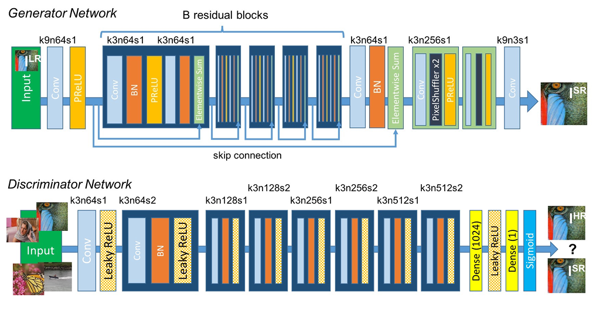

## Description

This repo contains the implementation of image super resolution models **SRResNet** (**S**uper **R**esolution **ResNet**) and SRGAN (**S**uper **R**esolution **GAN**) from scratch using DIV2K, Flickr2K datasets for training and Set5, Set14 datasets for testing. Click [here](https://arxiv.org/abs/1609.04802) to find the paper. Click [here](https://www.kaggle.com/datasets/sharansmenon/div2k) to get DIV2K dataset on kaggle and download it. Click [here](https://www.kaggle.com/datasets/daehoyang/flickr2k) to get Flickr2K dataset on kaggle and download it. Testing datasets can both be downloaded from [here](https://github.com/jbhuang0604/SelfExSR).

The figure below is taken from the paper linked above and represents the architecture of SRGAN.

<p align="center">

</p>

## Directory Structure and Usage
```
.
├── README.md
│
├── data/                            # dataset directory 
│   ├── train/                       # training datasets; separate dir for each (preferred, but not necessary)
│   │   ├── dataset_1
│   │   ├── dataset_2
│   │   └── ...
│   │
│   └── test/                        # testing datasets; separate dir for each
│
├── images/                          # directory containing images used in this repo
│
├── loss/                            
│   └── loss.py                      # includes loss functions 
│
├── utils/                           
│   ├── dataloader.py                # dataset and batch sampler class
│   ├── model.py                     # includes layers and and model arch code
│   └── utils.py                     # helper functions
│
├── SRGAN_train.py                   # training loop to train SRGAN model
├── SRResNet_train.py                # training loop to train SRResNet model
├── check_image_mode.py              # to check if all images are in RGB mode
├── test.py                          # code to evaluate and get results
└── vgg19_save.py                    # to save pretrained vgg19 model
```
