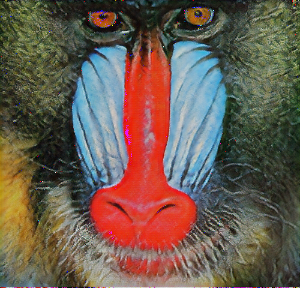
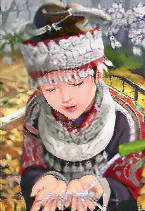
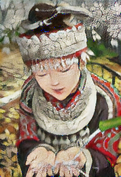

## Description

This repo contains the implementation of image super resolution models **SRResNet** (**S**uper **R**esolution **ResNet**) and SRGAN (**S**uper **R**esolution **GAN**) from scratch using DIV2K, Flickr2K datasets for training and Set5, Set14 datasets for testing. Click [here](https://arxiv.org/abs/1609.04802) to find the paper. Click [here](https://www.kaggle.com/datasets/sharansmenon/div2k) to get DIV2K dataset on kaggle and download it. Click [here](https://www.kaggle.com/datasets/daehoyang/flickr2k) to get Flickr2K dataset on kaggle and download it. Testing datasets can both be downloaded from [here](https://github.com/jbhuang0604/SelfExSR).

> NOTE : Original work used a subset of ImageNet dataset for training purposes (more details in the paper). I used freely available datasets on kaggle.

The figure below is taken from the paper linked above and represents the architecture of SRGAN.

<p align="center">

</p>

## Directory Structure and Usage
```
.
├── README.md
│
├── data/                            # dataset directory 
│   ├── train/                       # training datasets; separate dir for each (preferred, but not necessary)
│   │   ├── dataset_1
│   │   ├── dataset_2
│   │   └── ...
│   │
│   └── test/                        # testing datasets; separate dir for each
│
├── images/                          # directory containing images used in this repo
│
├── loss/                            
│   └── loss.py                      # includes loss functions 
│
├── utils/                           
│   ├── dataloader.py                # dataset and batch sampler class
│   ├── model.py                     # includes layers and and model arch code
│   └── utils.py                     # helper functions
│
├── SRGAN_train.py                   # training loop to train SRGAN model
├── SRResNet_train.py                # training loop to train SRResNet model
├── check_image_mode.py              # to check if all images are in RGB mode
├── test.py                          # code to evaluate and get results
└── vgg19_save.py                    # to save pretrained vgg19 model
```

## Installation

Create a python virtual environment / conda environment and install:
```sh
# first install CUDA 11.8 (only if you have NVIDIA GPU in your machine and compatible NVIDIA driver) 
# install pytorch with CUDA support (refer official docs)

python == 3.10.11
torch == 2.3.1+cu118 
torchvision == 0.18.1+cu118
```

## Steps To Run

1. Clone the project into your machine, and activate the environment in the project dir to run the code.
```
git clone https://github.com/VedantG-02/pytorch-ImageBoost
```
2. Download the dataset from the links provided above and place them in the ```data/train/``` or ```data/test/``` as shown in the above directory structure. Only use the scale factor 4 images in the ```test/``` sets, as the model here upscales 4x the low-res (LR) images.
3. (Optional) To check the count of images in the testing dataset(s) whose mode isn't RGB, run the following command:
```
python check_image_mode.py
```
4. To save the VGG19 pretrained model in order to carry out experiments using VGG Loss (and MSE Loss) as done by authors, run the following command:
```
python vgg19_save.py
```
5. To train SRResNet model (SRGAN uses pretrained SRResNet to initialize its generator), run the following command with appropriate arguments:
```sh
# args provided are the ones with which I trained the models
python SRResNet_train.py --epochs 100 --lr 0.0001 --batch_size 16 --lr_img_size 24 --sf 2 --loss_fn 'MSE'
```
6. To train SRGAN model (with SRResNet MSE as pretrained model), run the following commands (uses different loss functions):
```sh
# MSE Loss
python SRGAN_train.py --from_scratch 'n' --epochs 100 --lr 0.0001 --batch_size 16 --lr_img_size 24 --sf 2 --loss_fn 'MSE'

# VGG Loss
python SRGAN_train.py --from_scratch 'n' --epochs 100 --lr 0.0001 --batch_size 16 --lr_img_size 24 --sf 2 --loss_fn 'VGG' 
--i 2 --j 2
```
7. To evaluate the model on the test datasets and obtain PSNR values as well as generated images, run the following command:
```sh
# testing on Set5 dataset
python test.py --gen_name [ replace_your_gen_name_in_str ] --test_set 'Set5'

# testing on Set14 dataset
python test.py --gen_name [ replace_your_gen_name_in_str ] --test_set 'Set14'
```

## Results
Following are the images which I obtained after running ```test.py``` file. ```Original Image``` is taken from Set14 dataset. 
<div align="center">
  <table>
    <tr>
      <td align="center">
        
        <br>
        <em>Original Image</em>
      </td>
      <td align="center">
        
        <br>
        <em>SRGAN MSE output</em>
      </td>
      <td align="center">
        
        <br>
        <em>SRGAN VGG22 output</em>
      </td>
      <td align="center">
        
        <br>
        <em>SRResNet output</em>
      </td>
    </tr>
  </table>
</div>
<div align="center">
  <table>
    <tr>
      <td align="center">
        
        <br>
        <em>Original Image</em>
      </td>
      <td align="center">
        
        <br>
        <em>SRGAN MSE output</em>
      </td>
      <td align="center">
        
        <br>
        <em>SRGAN VGG22 output</em>
      </td>
      <td align="center">
        
        <br>
        <em>SRResNet output</em>
      </td>
    </tr>
  </table>
</div>

Each model is trained for **100** epochs and took me **~500** mins (**~8.5** hrs) to run each experiment on 1 NVIDIA GeForce GTX 1650 GPU. 
> NOTE : Authors of this paper trained the SRResNet model for 1000000 (1e6) iterations, and SRGAN for 100000 (1e5) iterations with lr=0.0001 and another 100000 (1e5) iterations with lr=0.00001. Compared to this the training done by me is much less and accordingly the results (PSNR values; in dB) are obtained which are shown below:

<div style="width: 100%; display: flex; justify-content: center;">
  
| test_set      | SRResNet (MSE) | SRGAN (MSE)  | SRGAN (VGG22) |
|     :---:      |     :---:      |     :---:      |     :---:      |
| ```Set5```     | 28.33781 | 25.73578 | 22.64799 |
| ```Set14```      | 25.53835 | 23.81825 | 21.16478 |

</div>


